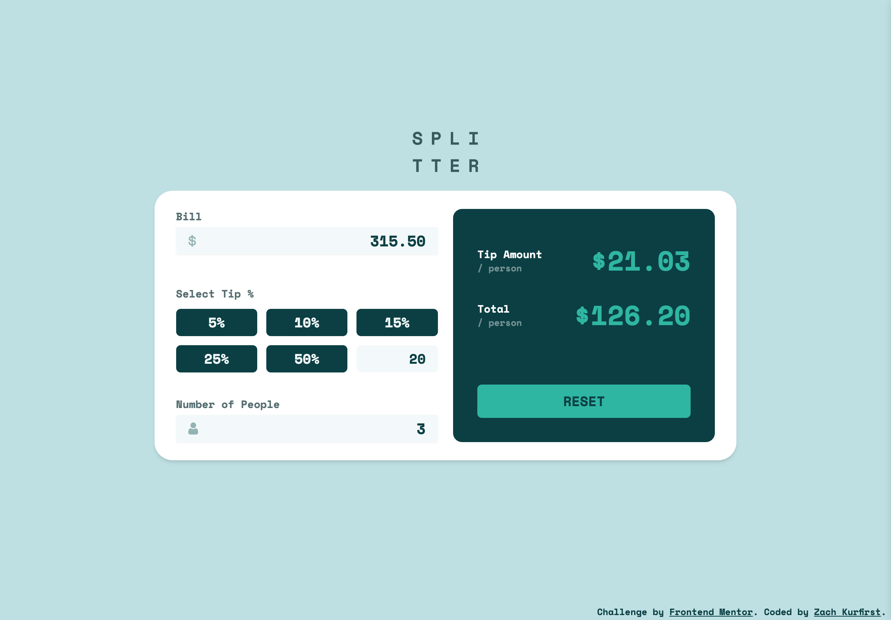

# Tip Calculator App

Hello there! Welcome to my solution to the [Tip calculator app challenge on Frontend Mentor](https://www.frontendmentor.io/challenges/tip-calculator-app-ugJNGbJUX "Tip Calculator App challenge").

## Table of contents

- [Overview](#overview)
  - [The challenge](#the-challenge)
  - [Screenshot](#screenshot)
  - [Links](#links)
- [My process](#my-process)
  - [Built with](#built-with)
  - [What I learned](#what-i-learned)
  - [Continued development](#continued-development)
  - [Useful resources](#useful-resources)
- [Author](#author)
- [Acknowledgments](#acknowledgments)

## Overview

### The challenge

- View the optimal layout for the app depending on their device's screen size
- See hover states for all interactive elements on the page
- Calculate the correct tip and total cost of the bill per person

### Screenshot



### Links

- [View live site](https://zachkurfirst-tip-calculator.vercel.app/ "Tip Calculator by Zach Kurfirst")
- [View solution on Frontend Mentor]()

## My process

### Built with

- [React](https://reactjs.org/ "React")
- [Vite](https://vitejs.dev/ "Vite | Next Generation Frontend Tooling") - React build tool
- JavaScript
- [Tailwind](https://tailwindcss.com/ "Tailwind CSS - Rapidly build modern websites without ever leaving your HTML.") - CSS framework
- [Vercel](https://vercel.com/ "Vercel website") - Deployment

### What I learned

During development, I learned a lot regarding input field validation and error states. I handled these in two ways, first by creating helper functions which I would tie to the three number input field's `onKeyDown` attribute to prevent certain characters from displaying.

```js
const blockInvalidBillChar = (e) =>
  ["e", "E", "+", "-"].includes(e.key) && e.preventDefault();
```

I then created boolean state such as `showBillError` to determine if/when the form should display an error message. In this specific example, I am displaying an error message if the user enters more than 2 decimal places. I used the `.test()` method to compare the user input to a regex value. If there's a match, I proceed and if not I set the error to true.

```js
const handleBillInput = (e) => {
  const input = e.target.value;
  const regex = /^(\d*\.{0,1}\d{0,2}$)/;
  if (regex.test(input)) {
    // account for empty string and delete input
    if (input === "") {
      setBill(input);
    } else {
      setBill(+input);
    }
    setShowBillError(false);
  } else {
    setShowBillError(true);
  }
};
```

Another challenge I overcame was regarding the 5 tip options, which I set up as radio buttons. I learned how to deselect an option if the user clicks the same option twice by creating the helper function `handleTipClick` and associating it to the radio input field's `onClick` attribute. This function simply determines if the user click matches the pre-existing set tip, and if so, resets the state and does some DOM manipulation to remove the hover class values. It's important to note that this function is separate from the primary `handleSelectedTip` function, which only runs `onChange` to set the new tip value. I am curious to see if maybe there could have been a way to handle all this through one function -- but the problem is the `onChange` attribute is required, and it doesn't fire off unless the tip value actually changes.

```js
const handleTipClick = (e) => {
  if (+e.target.value === tip) {
    setTip("");
    e.target.parentElement.classList.remove("hover:bg-light-grayish-cyan");
    e.target.parentElement.classList.remove("hover:text-very-dark-cyan");
  }
};
```

```js
const handleSelectedTip = (e) => {
  setTip(+e.target.value);
  setIsCustomTip(false);
};
```

The last thing I'll mention which was helpful was formatting the number values to currency. Using the `Intl.NumberFormat()` method, I was able to convert the numbers to valid USD currency with the below function and then call the function within the JSX on the `tipPP` (tip per person) and `totalPP` (total per person) prop values.

```js
const USD = (amt) =>
  new Intl.NumberFormat("en-US", {
    style: "currency",
    currency: "USD",
  }).format(amt);
```

```jsx
<p className="text-4xl text-strong-cyan">{USD(tipPP)}</p>
```

### Continued development

I want to continue working in React and getting more and more comfortable with handling state and writing optimized and performant code.

### Useful resources

- [Regexr](https://regexr.com/ "RegExr: Learn, Build, & Test RegEx") & [Regex101](https://regex101.com/ "regex101: build, test, and debug regex") - Helpful for referencing and testing regular expressions (regex)
- [MDN: RegExp.prototype.test()](https://developer.mozilla.org/en-US/docs/Web/JavaScript/Reference/Global_Objects/RegExp/test "RegExp.prototype.test() - JavaScript | MDN") vs. [MDN: String.prototype.match()](https://developer.mozilla.org/en-US/docs/Web/JavaScript/Reference/Global_Objects/String/match "String.prototype.match() - JavaScript | MDN")
- [How to work with radio buttons in React](https://dev.to/collegewap/how-to-work-with-radio-buttons-in-react-3e0o "How to work with radio buttons in React - DEV Community")
- [Free Code Camp: How to Format a Number as Currency in JavaScript](https://www.freecodecamp.org/news/how-to-format-number-as-currency-in-javascript-one-line-of-code/ "How to Format a Number as Currency in JavaScript")
- [Stack Overflow: How to add a style on a condition in tailwind css](https://stackoverflow.com/questions/67383686/how-to-add-a-style-on-a-condition-in-tailwind-css "javascript - How to add a style on a condition in tailwind css - Stack Overflow")
- [W3: How TO - Hide Arrows From Input Number](https://www.w3schools.com/howto/howto_css_hide_arrow_number.asp "How To Hide Arrows From Number Input")
- [Dev Community: How to block +,- and e in Number Input](https://dev.to/narendersaini32/how-to-block-and-e-in-number-input-1hoe "How to block +,- and e in Number Input - DEV Community")
- [Codeium AI Assistant](https://codeium.com/ "Codeium · Free AI Code Completion & Chat")
- [Tailwind CSS Documentation](https://tailwindcss.com/docs/installation "Installation - Tailwind CSS")
- [Tailwind UI: Input Groups](https://tailwindui.com/components/application-ui/forms/input-groups "Input Groups - Official Tailwind CSS UI Components")
- [Vercel Deployment Documentation](https://vercel.com/docs/deployments/overview "Deploying to Vercel")

## Author

- Website - [zachkurfirst.com](https://zachkurfirst.com "Zach Kurfirst portfolio")
- Frontend Mentor - [@zachkurfirst](https://www.frontendmentor.io/profile/zachkurfirst "Zach Kurfirst Frontend Mentor profile")

**Note: Delete this note and add/remove/edit lines above based on what links you'd like to share.**

## Acknowledgments

- [YouTube Tutorial from Coding in Public (Part 1)](https://www.youtube.com/live/Du-iS6RmP0g?si=G4jrwnIbkUanf4w9 "Live Code: Frontend Mentor React Tip Calculator App (Part 1)") & [Part 2](https://www.youtube.com/live/v7n4F26LSh0?si=hXWdRJUOrXUUbrVK "Live Code: Frontend Mentor React Tip Calculator App (Part 2)")
